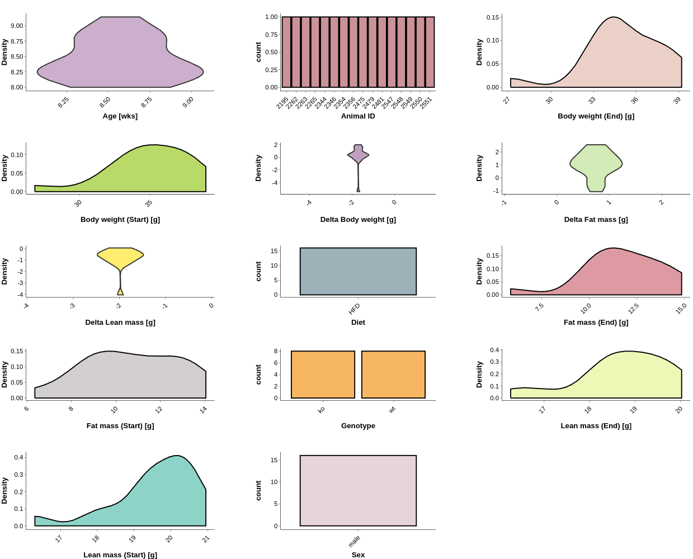
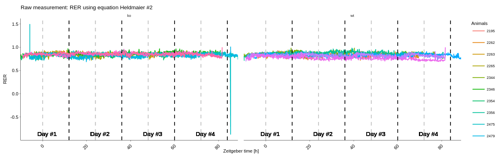
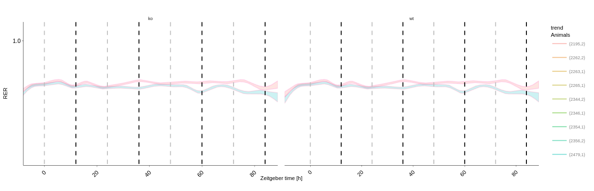
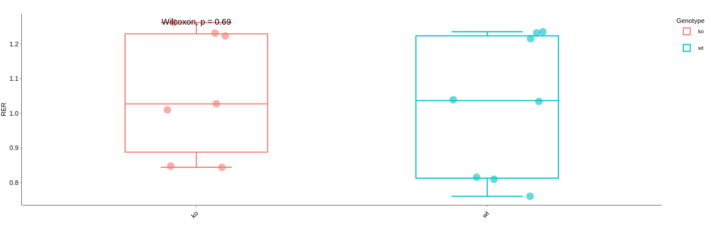

What is CALOR?
==============

CALOR is a web application based on Shiny R to allow streamlined visualization and statistical analysis of
indirect calorimetry data set making use of structured metadata to faciliate downstream analysis tasks.

For a very brief tour use the **User guide** button in the **Visualization and statistical analysis** tab
Short written examples are accessible through the **Getting help** button on the landing page.

Getting started
---------------

1. Loading and navigating the application
~~~~~~~~~~~~~~~~~~~~~~~~~~~~~~~~~~~~~~~~~

Navigate to `CALOR <https://shiny.iaas.uni-bonn.de/Calo>`_ access the Shiny web application.
The landing page displays some information about supported file formats and the app's main features, see
:ref:`calor_landing`. Click the **Visualization and statistical analysis** in the nagivation bar at the top
to get started. To get help or access a helper app use the **Getting help** or **Metadata converter** button.

.. _calor_landing:

.. figure:: img/calor_landing.png
   :align: center
   :alt: CALOR landing page
   :scale: 50%

   Figure 1: CALOR landing page

2. Loading indirect calorimetry data sets 
~~~~~~~~~~~~~~~~~~~~~~~~~~~~~~~~~~~~~~~~~~~~~~~~~~~~~~~~~~~

Jump ahead to the section **Conducting analyses with CALOR** to directly get started, or use the
**User guide** built into the application, see :ref:`load_example_data_set`.

2.1 Loading example data sets
~~~~~~~~~~~~~~~~~~~~~~~~~~~~~~~~~~~~~~~~~~~~~~~~~~~~~~~~~~~~~
Load example data sets and metadata, either **UCP1 KO** (4 cohort study) or **DAKO** (2 cohort study) are available. 
Metadata is automatically loaded and attached to the corresponding data set, see :ref:`load_example_data_set`.

.. _load_example_data_set:

.. figure:: img/01_a_intro_load_example_data_set.png
   :align: center
   :alt: Load example data set
   :scale: 50%

   Figure 1: Load example data set

2.2 Loading own data sets
~~~~~~~~~~~~~~~~~~~~~~~~~~~~~~~~~~~~~~~~~~~~~~~~~~~~~~~~~~~~~

Note that providing metadata is optional. Metadata can be added through the upload of a standardized and hierarchical
Excel Metadata Sheet (Seep et al., 2024, Scientific Data). Since the amount of metadata encoded in raw data file headers (short and non-standardized section
in the beginning of each data file exported from e.g. TSE Systems) is limited, some of the CALOR's functionality might not
be available for users providing only raw data sets. See :ref:`generate_metadata_sheet` below on how to generate 
standardized metadata for your data set(s).

To load your own data set, left-click on the large plus symbol.

.. _load_own_data_set:

.. figure:: img/01_b_intro_load_own_data_set.png
   :align: center
   :alt: Load own data set
   :scale: 50%
   
   Figure 2: Load own data set

If you already have the Metadata Sheet, simply tick **Have additional metadata?** in the top left section of the application,
and provide your individual cohorts (possible multiple) as file uploads by clicking on the **Browse...** button, see Figure :ref:`load_own_data_set_dialog`.
Adjust the **Number of data files** value according to your needs. Note that typically 2 or 4 cohorts are recorded per indirect calorimetry experiment.

.. _load_own_data_set_dialog:

.. figure:: img/01_b_intro_load_own_data_set_with_metadata.png
   :align: center
   :alt: Load own data set and metadata
   :scale: 50%

   Figure 3: File upload dialog for data and metadata

.. _generate_metadata_sheet:

3. Generate metadata sheet for indirect calorimetry data sets 
~~~~~~~~~~~~~~~~~~~~~~~~~~~~~~~~~~~~~~~~~~~~~~~~~~~~~~~~~~~~~
While this step is optional, we want to emphazise that generation of a Metadata Sheet for your cohort study has multiple 
benefits, i.e. statistical analysis of related metadata, comprehensive visualization of all collected metadata for the experiment,
streamlined statistical analysis and visualization of data sets supported by consistent metadata with corresponding units. 
(Reminder: For instance TSE Systems file headers provide limited and non-standardized metadata and is prone to unit and conversion
errors when combining cohort studies when not carefully exported from the PhenoMaster/LabMaster, also Metadata like Conditions
as cold exposure vs room temperate might be lacking).

If you already have filled out a Metadata Sheet (Seep et al., 2024, Scientific Data) for your indirect calorimetry experiment,
then you can skip this step, otherwise we encourage you to fill out either the full Metadata Sheet for your experiment (see 
the Excel Metadata Sheet template for indirect calorimetry data) or use the Metadata Sheet helper application to fill out 
the Metadata Sheet online if you have Excel not available. In the latter case navigate to `Metadata converter <https://shiny.iaas.uni-bonn.de/CaloHelper>`_. 
This application will allow you to fill out a Metadata Sheet and save it in Excel format for metadata input into CALOR.

First option: Provide an Excel (*.xlsx*) file with the following column structure to the Metadata converter:

Example metadata table for metadata converter
^^^^^^^^^^^^^^^^^^^^^^^^^^^^^^^^^^^^^^^^^^^^^

   +-----------+--------+------+----------+-------------+----------+---------+----------+--------+----------+--------+
   | Animal #  | sex    | diet | genotype | age at start| bw start | bw end  | fm start | fm_end | lm start | lm end |
   +===========+========+======+==========+=============+==========+=========+==========+========+==========+========+
   | 1         | male   | HFD  | KO       | 11          | 20       | 23      | 5        | 6      | 15       | 17     |
   +-----------+--------+------+----------+-------------+----------+---------+----------+--------+----------+--------+
   | 2         | female | CD   | UCP1     | 11          | 22       | 25      | 7        | 8      | 16       | 18     |
   +-----------+--------+------+----------+-------------+----------+---------+----------+--------+----------+--------+
   | ...       | ...    | ...  | ...      | ...         | ...      | ...     | ...      | ...    | ...      | ...    |
   +-----------+--------+------+----------+-------------+----------+---------+----------+--------+----------+--------+

You can display your input Excel sheet with the button **Display input Excel file** to confirm you adhere to the
required structure displayed in the example metadata table above, see :ref:`metadata_converter_landing`.

.. _metadata_converter_landing:

.. figure:: img/metadata_converter_landing.png
   :align: center
   :alt: Metadata converter landing page
   :scale: 50%

   Figure 4: Metadata converter

You can then download the metadata sheet by the download button **Download metadata sheet**.

Note that animal IDs (Animal #) need to be numeric, sex always specified as male or female, diet as a string, age at 
start must use the same unit, i.e. weeks or days, **bw** start, **bw** end, **fm** start, **fm** end, **lm** start and 
**lm** end correspond to the body weight, lean and fat mass at the start respectively end of the
experiment and to be reported in units of gram. All displayed columns are required. 

Second option: Manual fill-in of a Metadata Sheet by using the option **Specify metadata instead manually**. This will
guide you step by step through the input of your, e.g. 1, 2 or 4 cohorts study and collect the corresponding metadata
for each sample. Additional information, such as conditions (cold exposure vs room temperature) can be specified via the
*Condition* option which need to be enabled by a left-click on the **Enter study details** checkbox.

.. _metadata_converter_manual:

.. figure:: img/metadata_converter_manual.png
   :align: center
   :alt: Metadata converter landing page
   :scale: 50%

   Figure 4: Metadata converter manual input

You can then download the metadata sheet by the download button **Download metadata sheet**.

4. A Walk-through of CALOR's features
--------------------------------------------------------

Use the larger **+** (plus symbol) right to the **Plotting** section to expand options and see which quantities are available.

Note that on the right hand side a plot of the quantity of interest will be displayed, additional panels for **Statistical Analysis**,
**Modelling** and additional information about group comparisons are displayed.

During analysis, data might need further curation, e.g. exclusion of animals or recorded days. Use the **Data curation** 
panel analogue to the previous **Plotting** section to visualize and analyze results.

Note that all plots can be downloaded as high resolution vector or bitmap graphics by hovering over the plotting area,
a menu with options will appear at the top border of the plotting area then.

The next subsections will provide an overview of the individual analysis panels.

4.1 Inspect recorded metadata for your experiment
~~~~~~~~~~~~~~~~~~~~~~~~~~~~~~~~~~~~~~~~~~~~~~~~~~~~~~~~~~~~~

The metadata panel allows users to get an overview of the metadata and summary statistics thereof which have been
recorded alongside the indirect calorimetry experiment. Covariates like body weight, lean mass, fat mass can be compared.

Inspection of metadata should be always the starting point before conducting any analysis to assess the quality and quantity
of data recorded. For instance if there is a significant difference between two genotype groups', say KO and WT, body
composition, i.e. fat mass, further analysis should take the information into account before drawing conclusions.

4.2. Raw measurements
~~~~~~~~~~~~~~~~~~~~~~~~~~~~~~~~~~~~~~~~~~~~~~~~~~~~~~~~~~~~~

Raw measurement panel visualize the raw measurements of the respiratory gases oxygen and carbon dioxide, in either saturation
in percentage or volume changes over time intervals (typically recording intervals in indirect calorimetry experiments are
5 or 10 minutes). Derived quantities, as for instance the RER (respiratory exchange ratio) can be calculated. If desired,
users can pre-smooth or coarsen the raw traces (Typically not required).

4.3. Total heat production
~~~~~~~~~~~~~~~~~~~~~~~~~~~~~~~~~~~~~~~~~~~~~~~~~~~~~~~~~~~~~

The total heat production (THP) is the sum of :math:`THP = RMR+HP`, i.e. of resting metabolic rate and heat production (HP).
Alternatively one can interpret the THP as total energy expenditure (TEE) such that we have the sum :math:`TEE=RMR+EE`, which is 
defined by resting metabolic rate and energy expenditure (including physical activity).

Time traces, facetted (grouped) plots, ANOVA and ANCOVA analysis, and modelling of the dependent variable via linear-mixed effect model (LME)
panel is available.

4.4. Heat production
~~~~~~~~~~~~~~~~~~~~~~~~~~~~~~~~~~~~~~~~~~~~~~~~~~~~~~~~~~~~~

Heat production (HP) is the non-RMR contribution to the THP. Same analysis methods as for THP apply for the HP panel.

4.5. Resting Metabolic Rate
~~~~~~~~~~~~~~~~~~~~~~~~~~~~~~~~~~~~~~~~~~~~~~~~~~~~~~~~~~~~~

Resting metabolic rate (RMR) is the non-activity contribution to the THP. Same analysis methods as for THP apply for the RMR panel as well.

4.6. Fuel oxidation
~~~~~~~~~~~~~~~~~~~~~~~~~~~~~~~~~~~~~~~~~~~~~~~~~~~~~~~~~~~~~

Glucose and lipid oxidation are regarded under the umbrella term fuel oxidation. Same analyiss methods as for THP ally for the fuel oxidation panel too.

5. Conducting analyses with CALOR
---------------------------------

TODO: Add: Hypothesen aufstellen für die beiden Beispieldatensätze:
Gibt es Genotyp Effekte?
Dann TotalHeatProduction, HeatProduction, RestingMetabolicRate zeigen,
Dann ANOVAs
Dann ANCOVAs

5.1. Example data set I: UCP1 KO
~~~~~~~~~~~~~~~~~~~~~~~~~~~~~~~~~~~

.. container:: highlight-box

   :math:`H_0`:
   There is no genotype-specific effect (WT vs UCP1 KO) on the resting metabolic rate.

To either reject or accept the null hypothesis :math:`H_0` we can make use of CALOR's features.

First, we do inspect the metadata recorded with this 4 cohort study, to identify outliers or idiosyncrasies associated with the data set.

.. _ucp1_ko_metadata:

   Figure 5: Metadata for 4 cohort UCP1 KO data set

According to Fig. :ref:`ucp1_ko_metadata` distribution numbers (n) for Genotype and Diet are balanced, there is no 
irregularities for body composition (fat and lean mass) and also no problematic changes of body composition over the
time course of the experiment. The study entails only male samples (male) on a high fat diet (HFD). Since there are no
obvious issues with the metadata, we can proceed by inspecting the raw measurements as recordede from the metabolic phenotyping system (TSE).

Plotting the raw quantities can be a valid and important first diagnostic of consistency of the experiment. 
See Fig. :ref:`ucp1_ko_rer_with_outlier` in particular for the RER stratified by Genotype (WT vs KO).

.. _ucp1_ko_rer_with_outlier:

   Figure 6: RER for UCP1 KO with outlier

We identify an outlier which has an erratic RER time plot, and thus also an erratic oxygen and carbon dioxide curve,
since RER is defined as: :math:`RER=\frac{\dot{V}_{CO_{2}}}{\dot{V}_{O_{2}}} \in [0,1]`.

Therefore we proceed with the *Data Curation* panel in the bottom left of the application, we remove outlier **2547**,
resulting in the stratified plots of RER as depicted in Fig. :ref:`ucp1_ko_rer_without_outlier`.

.. _ucp1_ko_rer_without_outlier:

   Figure 7: RER for UCP1 KO without outlier 2547

Notice that there is no qualitative (significant) difference between the mean traces of RER for the two genotypes.
(Displayed are mean and standard deviation ribbons as can be configure directly below the plot in the application).

We can confirm this by navigating to the *Statistical Testing* panel to conduct a 1-way ANOVA on day averaged values of RER,
revealing no statistical significant difference for genotypes, see Fig. :ref:`rer_anova` and employ for this the *Wilcoxon-test*
as a non-parametric test since we are operating in the low *n* regime. Other tests for post-hoc analysis can be selected in the
application directly above the plot panel. Multiple-testing corrections can be selected when conducting higher-order ANOVAs,
which we do not require here since our only factor is the genotype with two levels (minimum for ANOVAs or a unpaired t-test).

.. _rer_anova:

   Figure 8: 1-way ANOVA on genotype stratifiction for RER

Since outliers are now removed, we can inspect the total heat production, in order to answer our null hypothesis.

TODO: Write paragraph on THP -> show also statistics again ANOVA

TODO: Write paragraph on RMR -> show also statistics again ANOVA

.. container:: highlight-box

   :math:`Conclusion`:
   There is no genotype-specific effect (WT vs UCP1 KO) on neither THP or RMR.

Since there are no changes in THP or RMR when considering only the genotype, we
want now to consider also the during the experiment recorded covariates, i.e.
lean mass and fat mass (or changes therefore, in the following we use the terms
delta lm and delta fm) or the whole body weight (or delta bw) and their influence
on the THP and RMR in the KO and WT genotype. To factor this into our statistical
model, we will make use of 1-way ANOVAs during our further analysis.

In layman's terms the 1-way ANOVA model is formulated as follows, where 
the dependent variable :math:`\text{DependentVar}`, the covariate :math:`\text{Covariate}`, 
and the grouping variable :math:`\text{Group}` appear in the model as:

.. math::

   \text{DependentVariable}_{ij} = \mu + \tau_i + \beta (\text{Foo}_{ij} - \bar{\text{Foo}}) + \epsilon_{ij}

Where:

- :math:`\mu` is the overall mean.
- :math:`\tau_i` is the effect of the :math:`i`-th group (:math:`\text{Group}`).
- :math:`\beta` is the regression coefficient for the covariate :math:`\text{Covariate}`.
- :math:`\text{Covariate}_{ij}` is the value of the covariate :math:`\text{Covariate}` for observation :math:`j` in group :math:`i`.
- :math:`\bar{\text{Covariate}}` is the mean of the covariate :math:`\text{Covariate}` across all observations.
- :math:`\epsilon_{ij}` is the random error term.

In this model:

- The covariate :math:`\text{Covariate}` is adjusted by subtracting its mean (:math:`\bar{\text{Covariate}}`), centering it to reduce multicollinearity.
- The :math:`\beta` term measures the relationship between the covariate :math:`\text{Covariate}` and the dependent variable :math:`\text{DependentVariable}`.

The ANCOVA tests whether the group effects :math:`\tau_i` are significant while controlling for the covariate :math:`\text{Covariate}`.
Do not worry, test assumptions are reported in *Details Panel*, and most importantly if the statistical test is valid to be applied for our data set.

Thus our first null hypothesis for the RM can be stated as:

.. container:: highlight-box

   :math:`H_0`:
   There is a genotype-specific effect (WT vs UCP1 KO) on RMR corrected for one 
   of the covariates (lm, fm or bw)

Likewise an anlog null hypothesis for the THP can be stated as:

.. container:: highlight-box

   :math:`H_0`:
   There is a genotype-specific effect (WT vs UCP1 KO) on THP corrected for one 
   of the covariates (lm, fm or bw)

Now, we will proceed as before, but make use of 1-way ANOVAs for THP 
(inluding either lm, fm or bw) and RMR (including either lm, fm or bw)
grouped by genotype KO and WT.

For RMR see Fig. ... and THP see Fig. ... .

--> then show ANCOVA for fat and lean mass getrennt, no differences either

--> then show ANCOVA for fat and lean mass getrennt, no differences either

.. container:: highlight-box

   :math:`Final conclusion`.
   TODO: no effect...

5.2. Example data set II: DAKO KO
~~~~~~~~~~~~~~~~~~~~~~~~~~~~~~~~~~~

TODO: Add

5.3. Own data set
~~~~~~~~~~~~~~~~~~~~~~

TODO: Add

6. Data export
--------------
To export combined data sets for all cohorts, data frames for plotting of results, and calculated quantities,
all data can be download through the **Data export** panel, choose the *.zip* download which downloads one
compressed file containing all data.

Tutorial videos
====================

Workflow and use-cases are documented in a series of short instructional YouTube videos demonstrating the features of the
web application: `@CALOR-APP <https://www.youtube.com/@CALOR-APP>`_.

TODO: Add short videos for all of the subsections above.

Flow charts
=============

Statistical analysis
--------------------

TODO: Add Entscheidungshilfe, welche Statistik muss berechnet oder genutzt werden. Eine Abbildung erzeugen hier.

Analysis of indirect calorimetry data
-------------------------------------

TODO: Add Entscheidungshilfe, was will ich analysieren, und muss dementsprechend in CALOR auswählen. Eine Abbildung erzeugen hier.
