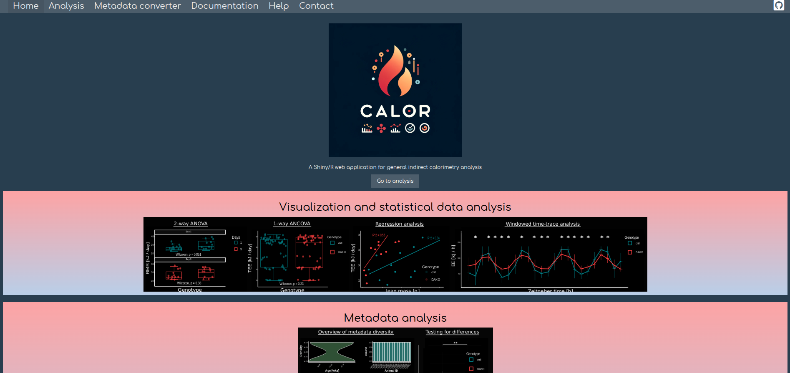

What is CALOR?
==============

CALOR is a web application based on Shiny for GNU R to allow for a streamlined and comprehensive analysis of 
indirect calorimetry data. CALOR supports most of the major indirect calorimetry systems, i.e. TSE Systems, Sable Systems and
the COSMED platform. Metadata analysis, visualization and statistical analysis of the entirety of indirect calorimetry
measurements are instrumental for biomedical researchers and accordingly implemented in CALOR.  

Furthermore CALOR ingests structured, hierarchical metadata sheets in the Excel format to faciliate downstream analysis tasks,
in particular standardized metadata renders useful in multi-factor analyses and allows for unit consistency across experiments.

For a brief tour use the in-app **User guide** (available via the corresponding button) from the **Visualization and statistical analysis** tab.
Short expository examples are accessible through the **Help** button on the landing page of the app (left click the red question mark in the linked page).

In case you encounter issues while using the app (e.g. bugs), please report them using the version and session information stated in the bottom right corner.
Likewise, if you miss features (or any indirect calorimetry system) vital to the analysis of your indirect calorimetry experiments, let us know by email (see contact section) or 
use the issue tracker on the linked Github repository.

A compiled list of common questions and issues are collected in the FAQ section at the end of the documentation, which might provide already the directions you require to solve your problem.

Getting started
===============

Navigating the application
~~~~~~~~~~~~~~~~~~~~~~~~~~

Navigate to the landing page on `CALOR <https://shiny.iaas.uni-bonn.de/Calo>`_ to access the web application.

The landing page displays information about the supported file formats and the application's main features, see
:ref:`calor_landing`. Click the **Go to analysis** tab in the nagivation bar at the top or below the CALOR logo
to immediately get started with your analysis. To get help and access a helper application which is used to generate 
standardized metadata sheets for your own indirect calorimetry experiments use the **Help** respectively **Metadata converter** 
button from the navigation bar.

.. _calor_landing:

   Figure 1: CALOR landing page and overview of common analysis tasks

Loading indirect calorimetry datasets 
~~~~~~~~~~~~~~~~~~~~~~~~~~~~~~~~~~~~~~~~~~~~~~~~~~~~~~~~~~~

Click the button **Go to analysis** to directly get started. Use the
**User guide** built into the application in the section **Dataset import -> Example Data** to get a tour of the application, 
see Figure :ref:`load_example_data_set`.

Loading example datasets
------------------------
Load example datasets and metadata, either **UCP1 KO** (4 cohort study) or **DAKO** (2 cohort study) are available. 
Metadata is automatically loaded and attached to the corresponding dataset, see Figure :ref:`load_example_data_set`.

.. _load_example_data_set:

   Figure 1: Load example datasets and activation of the user guide

Loading own datasets
--------------------

Provision of metadata is optional. However, metadata can be added through the upload of a standardized and hierarchical
Excel Metadata Sheet (Seep et al., 2024, Scientific Data). Since the amount of metadata encoded in raw data file headers 
(short and non-standardized section in the beginning of each data file exported from e.g. TSE Systems, etc.) is limited, 
and usually error-prone, as metadata fields have to be specified by users of the indirect calorimetry system individually,
we recommend to provide a Metadata Sheet. Also under certain circumstances, not all of CALOR's functionality might be
available for users providing only raw datasets. See :ref:`generate_metadata_sheet` below on how to generate 
standardized metadata for your data set(s) with either fixed format Excel template or the Metadata converter Shiny application.

To load your own dataset, left-click on the large plus symbol.

.. _load_own_data_set:

.. figure:: img/01_b_intro_load_own_data_set.png
   :align: center
   :alt: Load own data set
   :scale: 50%
   
   Figure 2: Load own data set

If you already have the Metadata Sheet, simply tick **Have additional metadata?** in the top left section of the application,
and provide your individual cohorts (possible multiple) as file uploads by clicking on the **Browse...** button, see Figure :ref:`load_own_data_set_dialog`.
The metadata for all cohorts is recorded conveniently in a single Excel sheet for the whole study.

Adjust the **Number of data files** value according to your needs. Note that typically 2 or 4 cohorts are recorded per indirect calorimetry experiment.

.. _load_own_data_set_dialog:

   Figure 3: File upload dialog for data and metadata

.. _generate_metadata_sheet:

Generation of metadata sheets
~~~~~~~~~~~~~~~~~~~~~~~~~~~~~
While this step is optional, we want to emphazise that generation of a Metadata Sheet for your cohort study has multiple 
benefits, i.e. statistical analysis of related metadata, comprehensive visualization of all collected metadata for the experiment,
streamlined statistical analysis and visualization of datasets supported by consistent metadata with corresponding units. 

Reminder: For instance TSE Systems file headers provide limited and non-standardized metadata and is prone to unit and conversion
errors when combining cohort studies when not carefully exported from the PhenoMaster/LabMaster with identical settings by the user
, also categorical metadata, e.g. conditions (cold exposure vs room temperate), treatments (feeding pattern), photoperiod, etc.  might be lacking.

If you already have filled out a Metadata Sheet (Seep et al., 2024, Scientific Data) for your indirect calorimetry experiment,
then you can skip this step, otherwise we encourage you to fill out either the full Metadata Sheet for your experiment (see 
the Excel Metadata Sheet template for indirect calorimetry data) or use the Metadata Sheet helper application to fill out 
the Metadata Sheet online if you have Excel not available. 

In the latter case navigate to `Metadata converter <https://shiny.iaas.uni-bonn.de/CaloHelper>`_. 
This application will allow you to fill out a Metadata Sheet and save it in Excel format for metadata input into CALOR.

First option: Provide an Excel (*.xlsx*) file with the following column structure to the Metadata converter:

   +-----------+--------+------+----------+-------------+----------+---------+----------+--------+----------+--------+
   | Animal #  | sex    | diet | genotype | age at start| bw start | bw end  | fm start | fm_end | lm start | lm end |
   +===========+========+======+==========+=============+==========+=========+==========+========+==========+========+
   | 1         | male   | HFD  | KO       | 11          | 20       | 23      | 5        | 6      | 15       | 17     |
   +-----------+--------+------+----------+-------------+----------+---------+----------+--------+----------+--------+
   | 2         | female | CD   | UCP1     | 11          | 22       | 25      | 7        | 8      | 16       | 18     |
   +-----------+--------+------+----------+-------------+----------+---------+----------+--------+----------+--------+
   | ...       | ...    | ...  | ...      | ...         | ...      | ...     | ...      | ...    | ...      | ...    |
   +-----------+--------+------+----------+-------------+----------+---------+----------+--------+----------+--------+

You can display your input Excel sheet with the button **Display input Excel file** to confirm you adhere to the
required structure displayed in the example metadata table above, see :ref:`metadata_converter_landing`.

.. _metadata_converter_landing:

.. figure:: img/metadata_converter_landing.png
   :align: center
   :alt: Metadata converter landing page
   :scale: 50%

   Figure 4: Metadata converter

You can then download the metadata sheet by the download button **Download metadata sheet**.

Note that animal IDs (Animal #) need to be numeric, sex always specified as male or female, diet as an alphanumerical string, age at 
start must use the same unit, i.e. weeks or days, **bw** start, **bw** end, **fm** start, **fm** end, **lm** start and 
**lm** end correspond to the body weight, lean and fat mass at the start respectively end of the
experiment and to be reported in units of gram. All displayed columns are required. 

Second option: Manual fill-in of a Metadata Sheet by using the option **Specify metadata instead manually**. This will
guide you step by step through the input of your, e.g. 1, 2 or 4 cohorts study and collect the corresponding metadata
for each sample. Additional information, such as conditions (cold exposure vs room temperature) can be specified via the
*Condition* option which need to be enabled by a left-click on the **Enter study details** checkbox.

.. _metadata_converter_manual:

.. figure:: img/metadata_converter_manual.png
   :align: center
   :alt: Metadata converter landing page
   :scale: 50%

   Figure 4: Metadata converter manual input

You can then download the metadata sheet by the download button **Download metadata sheet**.

